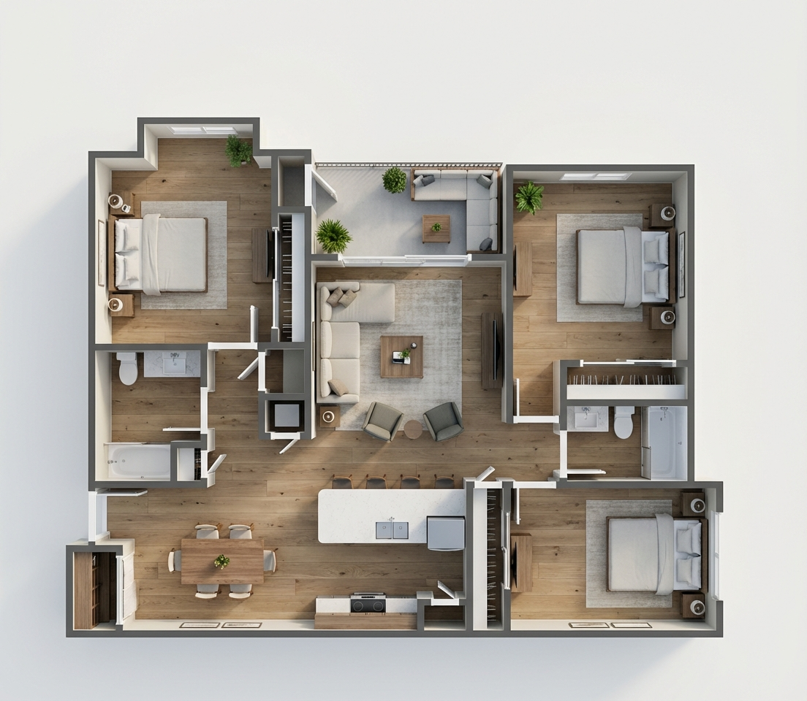

# 🏡 RealEstateOS

**Transform empty properties into dream homes instantly with Gemini 3.0 Pro.**


## 🏆 Built for the Google Gemini API Developer Competition
**RealEstateOS** is an AI-powered platform that revolutionizes real estate marketing. By leveraging the advanced multimodal capabilities of **Gemini 3.0 Pro**, we automate the most expensive and time-consuming parts of selling a home: staging, design visualization, and listing creation.

---

## 💡 The Problem
In real estate, **visualization is everything**.
*   **Empty rooms don't sell:** Buyers struggle to imagine the potential of an empty space.
*   **Staging is expensive:** Physical staging costs thousands of dollars and takes weeks.
*   **Floor plans are abstract:** 2D blueprints are hard for the average buyer to understand emotionally.

## 🚀 The Solution
**RealEstateOS** provides a comprehensive suite of AI tools to "finish" a home digitally in seconds, powered entirely by a single, unified model: **Gemini 3.0 Pro**.

### Key Features

#### 1. 🛋️ AI Virtual Staging
Upload a photo of an empty room. **Gemini 3.0 Pro** analyzes the room's geometry, lighting, and architectural features (windows, doors, perspective). It then generates a stunning, professionally staged version of the room in your chosen style (Modern, Scandinavian, Luxury, etc.), preserving the exact camera angle and structural integrity.

#### 2. 🏠 Floor Plan to Full Home Design
Upload a simple 2D floor plan (image or PDF).
*   **Analyze:** Gemini 3.0 Pro's vision capabilities extract every room, its function, and dimensions from the blueprint.
*   **Design:** The AI creates a cohesive "Design System" (flooring, materials, color palette) for the whole house.
*   **Visualize:** Generates a stunning **3D Isometric View** of the entire home layout.
*   **Render:** Automatically creates photorealistic views for each individual room throughout the home.

#### 3. ✍️ Instant MLS Listing Copy
Stop struggling with descriptions. Based on the visual analysis of the home's features and the applied design style, **Gemini 3.0 Pro** generates professional, emotional, and sales-ready listing descriptions in seconds.

---

## 🛠️ Tech Stack & AI Models

*   **Frontend:** Next.js 14, React, TailwindCSS, Framer Motion
*   **AI Engine:** **Gemini 3.0 Pro**
    *   **Unified Multimodal Power:** We utilize Gemini 3.0 Pro for *all* tasks: visual reasoning, architectural analysis, creative direction, image generation, and copywriting.
    *   **Zero-Shot Reasoning:** Leveraging the model's advanced understanding of spatial relationships and design aesthetics without complex fine-tuning.

---

## 📸 Demo

> **[Link to Demo Video]** (Add your YouTube/Loom link here)

### Screenshots
| Virtual Staging | 3D Floor Plan |
|:---:|:---:|
|  |  |

---

## 🚀 Getting Started

### Prerequisites
*   Node.js 18+
*   A Google Cloud Project with the **Gemini API** enabled.

### Installation

1.  **Clone the repository**
    ```bash
    git clone https://github.com/engrtitooo/RealEstateOS.git
    cd RealEstateOS
    ```

2.  **Install dependencies**
    ```bash
    npm install
    ```

3.  **Set up Environment Variables**
    Create a `.env.local` file in the root directory:
    ```env
    GOOGLE_API_KEY=your_gemini_api_key_here
    ```

4.  **Run the Development Server**
    ```bash
    npm run dev
    ```

5.  Open [http://localhost:3000](http://localhost:3000) in your browser.

---

## 🐳 Docker Deployment

### Build & Run Locally with Docker

1.  **Build the Docker image**
    ```bash
    docker build -t realestateos .
    ```

2.  **Run the container**
    ```bash
    docker run -p 3000:3000 -e GOOGLE_API_KEY=your_gemini_api_key realestateos
    ```

3.  Open [http://localhost:3000](http://localhost:3000) in your browser.

### Deploy to Google Cloud Run

1.  **Push your code to GitHub**
    ```bash
    git add .
    git commit -m "Add Docker support for Cloud Run"
    git push
    ```

2.  **Deploy via Cloud Console**
    - Navigate to [Cloud Run](https://console.cloud.google.com/run)
    - Click **Create Service**
    - Select **Continuously deploy from a repository**
    - Connect your GitHub repository
    - Choose **Dockerfile** as the build type
    - Set environment variable: `GOOGLE_API_KEY`
    - Click **Create**

---

## 🧠 How It Works (Under the Hood)

1.  **Unified Intelligence (Gemini 3.0 Pro):**
    Unlike traditional pipelines that chain multiple weak models, RealEstateOS uses the massive context window and multimodal reasoning of Gemini 3.0 Pro to handle the entire pipeline.
    
2.  **Visual Reasoning:**
    When you upload a photo, Gemini 3.0 Pro doesn't just "see" pixels; it understands the *physics* of the room—light sources, perspective lines, and scale.

3.  **Generative Design:**
    Using this deep understanding, the model generates furniture and decor that fit perfectly into the scene, respecting the original lighting and geometry of the user's home.

---

## 🤝 Contributing
Contributions are welcome! Please feel free to submit a Pull Request.

## 📄 License
This project is licensed under the MIT License.
